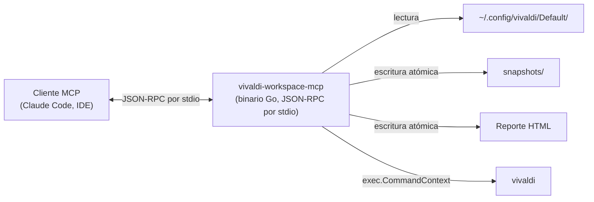
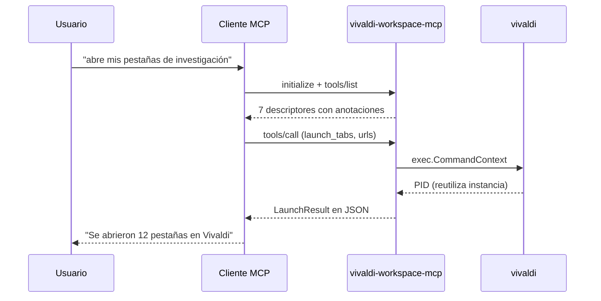

# vivaldi-workspace-mcp

[](https://go.dev)
[](https://opensource.org/licenses/MIT)
[](https://github.com/modelcontextprotocol/modelcontextprotocol)
[](https://vivaldi.com)
[](https://github.com/LOUST-PRO/vivaldi-workspace-mcp/stargazers)
[](https://github.com/LOUST-PRO/vivaldi-workspace-mcp/forks)
[](https://github.com/LOUST-PRO/vivaldi-workspace-mcp/issues)

Servidor **MCP** (Model Context Protocol) **únicamente local**, escrito en **Go**, que inspecciona, extrae, organiza y gestiona los **Espacios de Trabajo (Workspaces)** y sesiones de pestañas del navegador **Vivaldi** en Linux. Binario estático único, cero salida de red, sin telemetría, sin daemon.

*Read this document in [English](README.md).*

---

## Qué hace

vivaldi-workspace-mcp expone **7 herramientas (tools)** que un asistente de IA compatible con MCP (o cualquier cliente MCP) puede llamar para interactuar con tu sesión de Vivaldi en ejecución:

- 📂 Listar los Espacios de Trabajo configurados en tu perfil.
- 🔖 Extraer URLs de pestañas abiertas y recuperadas de los archivos binarios de sesión de Vivaldi (`Sessions/Tabs_*`).
- 📊 Exportar un reporte HTML buscable con todas las pestañas recuperadas, agrupadas por dominio.
- 🚀 Lanzar URLs en la instancia de Vivaldi en ejecución.
- 💾 Guardar un snapshot del estado actual y restaurarlo después.

Consulta la [tabla de herramientas](#herramientas) más abajo para ver el detalle.

---

## Arquitectura



El servidor **nunca** abre un puerto TCP, nunca habla con un servicio remoto y nunca escribe fuera de la ruta del reporte HTML provista por el usuario y de `$XDG_DATA_HOME/vivaldi-workspace-mcp/`. Consulta [`docs/security-model.md`](docs/security-model.md) para el detalle del límite de confianza.

---

## Herramientas

Las 7 herramientas declaran explícitamente las `ToolAnnotations` de MCP 2025-06-18, de modo que el cliente puede mostrar avisos de "puede modificar estado" antes de invocarlas:

| Herramienta | Anotaciones | Efecto |
|---|---|---|
| `list_workspaces` | solo lectura, idempotente, mundo cerrado | Lee `Preferences`. |
| `list_workspace_tabs` | solo lectura, idempotente, mundo cerrado | Lee `Sessions/Tabs_*`. |
| `export_workspace_html` | modifica estado, idempotente, mundo cerrado | Escribe un archivo HTML atómicamente. |
| `launch_tabs` | modifica estado, idempotente, mundo cerrado | Lanza `vivaldi` solo con URLs http(s). |
| `save_workspace_snapshot` | modifica estado, idempotente, mundo cerrado | Escribe `snapshot.json` atómicamente. |
| `restore_workspace_snapshot` | modifica estado, idempotente, mundo cerrado | Relanza URLs del snapshot en lotes de 30. |
| `list_snapshots` | solo lectura, idempotente, mundo cerrado | Lee metadatos de los snapshots. |

Las URLs pasadas a `launch_tabs` deben comenzar con `http://` o `https://` y tener al menos 12 caracteres. Otros esquemas (`file://`, `javascript:`, esquemas personalizados) se reportan en `rejected_urls`, no se descartan en silencio. Esto es intencional: consulta [security-model.md](docs/security-model.md#por-qu%C3%A9-restringimos-esquemas-de-url).

---

## Cómo funciona MCP (60 segundos)

Si nunca has usado MCP antes:



MCP es **JSON-RPC 2.0 sobre stdio**. El host (tu asistente de IA) envía un frame JSON por línea al stdin del servidor; el servidor escribe una respuesta JSON por línea en stdout. Lee el manual completo en [`docs/mcp-protocol.md`](docs/mcp-protocol.md) o en la [especificación oficial de MCP](https://github.com/modelcontextprotocol/modelcontextprotocol).

---

## Instalación

### 1. Compilar desde fuente

Requiere Go 1.26+.

```bash
git clone https://github.com/LOUST-PRO/vivaldi-workspace-mcp.git
cd vivaldi-workspace-mcp
go build -o bin/vivaldi-workspace-mcp .
```

### 2. Configurar en tu cliente MCP

En `~/.claude/settings.json` (o el equivalente de tu cliente):

```json
{
  "mcpServers": {
    "vivaldi-workspace": {
      "command": "/ruta/absoluta/a/bin/vivaldi-workspace-mcp"
    }
  }
}
```

El servidor requiere que Vivaldi esté instalado en la ubicación estándar (binario `vivaldi` en `$PATH`) y un perfil en `~/.config/vivaldi/Default/`.

### 3. Probarlo

Desde tu cliente MCP:

> "Lista mis espacios de trabajo de Vivaldi."

El cliente debería llamar a `list_workspaces` y mostrar el resultado. Consulta [docs/architecture.md](docs/architecture.md#tool-surface) para ver qué retorna cada herramienta.

---

## Documentación

Los documentos de cara al usuario y al revisor viven en [`docs/`](docs/README.md):

- 📐 [Arquitectura](docs/architecture.md) — diagrama del sistema y flujo por herramienta.
- 🔌 [Manual del Protocolo MCP](docs/mcp-protocol.md) — JSON-RPC, anotaciones, tour de 60 segundos.
- 🔒 [Modelo de Seguridad](docs/security-model.md) — límite de confianza, cadena de suministro, qué hace y qué no hace el servidor.
- 💾 [Snapshots](docs/snapshots.md) — esquema, contrato de estabilidad, semántica de restauración.
- ⚙️ [Notas de Concurrencia en Go](docs/go-concurrency.md) — modelo de hilos, particularidades del transporte stdio.

---

## Pruebas locales

```bash
go test ./...
go vet ./...
scripts/smoke.sh
```

El smoke test envía frames JSON-RPC por stdio y verifica que cada herramienta retorna el sobre esperado, incluyendo las anotaciones.

---

## Estado del proyecto

vivaldi-workspace-mcp es **software local-first**: cada release es reproducible desde la fuente con `go build`. No hay telemetría, ni analítica, ni configuración remota. El proyecto sigue [Semantic Versioning](https://semver.org/).

---

## Licencia

Distribuido bajo la Licencia MIT. Consulta `LICENSE` para más detalles.

---

## Marcas registradas

Vivaldi® es una marca registrada de Vivaldi Technologies. Este proyecto es una integración independiente no oficial y no está afiliado, respaldado ni patrocinado por Vivaldi Technologies. El distintivo de la marca Vivaldi en el encabezado es renderizado por [shields.io](https://shields.io) usando el set [SimpleIcons](https://simpleicons.org/?q=vivaldi) y no implica respaldo.
