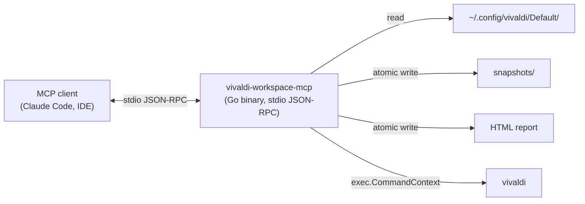
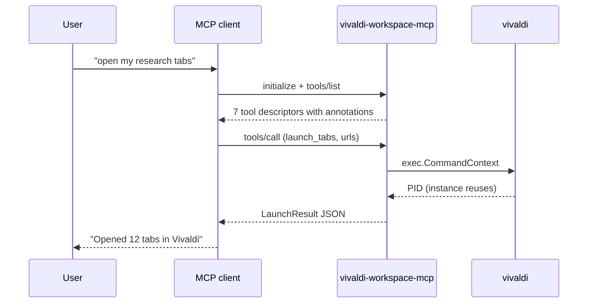

# vivaldi-workspace-mcp

[](https://go.dev)
[](https://opensource.org/licenses/MIT)
[](https://github.com/modelcontextprotocol/modelcontextprotocol)
[](https://vivaldi.com)
[](https://github.com/LOUST-PRO/vivaldi-workspace-mcp/stargazers)
[](https://github.com/LOUST-PRO/vivaldi-workspace-mcp/forks)
[](https://github.com/LOUST-PRO/vivaldi-workspace-mcp/issues)

A **local-only** Model Context Protocol (MCP) server written in **Go** that inspects, extracts, organizes, and manages **Vivaldi Workspaces** and tab sessions on Linux. Single static binary, zero network egress, no telemetry, no daemon.

*Lee este documento en [Español](README.es.md).*

---

## What it does

vivaldi-workspace-mcp exposes **7 tools** that an MCP-aware AI assistant (or any MCP client) can call to interact with your running Vivaldi browser session:

- 📂 List configured Vivaldi Workspaces from your profile.
- 🔖 Extract open and recovered tab URLs from Vivaldi's binary session files (`Sessions/Tabs_*`).
- 📊 Export a searchable HTML report of all recovered tabs, grouped by domain.
- 🚀 Launch URLs in the running Vivaldi instance.
- 💾 Snapshot the current state and restore it later.

See the [tool reference](#tools) below for the full table.

---

## Architecture



The server **never** opens a TCP port, never speaks to a remote service, and never writes outside the user-supplied HTML export path and `$XDG_DATA_HOME/vivaldi-workspace-mcp/`. See [`docs/security-model.md`](docs/security-model.md) for the full trust boundary.

---

## Tools

All 7 tools carry explicit MCP 2025-06-18 `ToolAnnotations` so the client can render "may modify state" hints before invocation:

| Tool | Annotations | Effect |
|---|---|---|
| `list_workspaces` | read-only, idempotent, closed-world | Reads `Preferences`. |
| `list_workspace_tabs` | read-only, idempotent, closed-world | Reads `Sessions/Tabs_*`. |
| `export_workspace_html` | mutating, idempotent, closed-world | Writes a single HTML file atomically. |
| `launch_tabs` | mutating, idempotent, closed-world | Spawns `vivaldi` with http(s) URLs only. |
| `save_workspace_snapshot` | mutating, idempotent, closed-world | Writes `snapshot.json` atomically. |
| `restore_workspace_snapshot` | mutating, idempotent, closed-world | Re-launches snapshot URLs in batches of 30. |
| `list_snapshots` | read-only, idempotent, closed-world | Reads snapshot metadata. |

URLs passed to `launch_tabs` must start with `http://` or `https://` and be at least 12 characters long. Other schemes (`file://`, `javascript:`, custom schemes) are reported back in `rejected_urls`, not silently dropped. This is intentional: see [security-model.md](docs/security-model.md#why-we-restrict-url-schemes).

---

## How MCP works (60-second primer)

If you have never used MCP before:



MCP is **JSON-RPC 2.0 over stdio**. The host (your AI assistant) sends one JSON frame per line on the server's stdin; the server writes one JSON response per line on stdout. Read the full primer in [`docs/mcp-protocol.md`](docs/mcp-protocol.md) or the [official MCP specification](https://github.com/modelcontextprotocol/modelcontextprotocol).

---

## Installation

### 1. Build from source

Requires Go 1.26+.

```bash
git clone https://github.com/LOUST-PRO/vivaldi-workspace-mcp.git
cd vivaldi-workspace-mcp
go build -o bin/vivaldi-workspace-mcp .
```

### 2. Configure in your MCP client

In `~/.claude/settings.json` (or your client's equivalent):

```json
{
  "mcpServers": {
    "vivaldi-workspace": {
      "command": "/absolute/path/to/bin/vivaldi-workspace-mcp"
    }
  }
}
```

The server requires Vivaldi to be installed at the standard location (`vivaldi` binary in `$PATH`) and a profile at `~/.config/vivaldi/Default/`.

### 3. Try it

From your MCP client:

> "List my Vivaldi workspaces."

The client should call `list_workspaces` and surface the result. See [docs/architecture.md](docs/architecture.md#tool-surface) for what each tool returns.

---

## Documentation

End-user and reviewer-facing docs live in [`docs/`](docs/README.md):

- 📐 [Architecture](docs/architecture.md) — system diagram and per-tool data flow.
- 🔌 [MCP Protocol Primer](docs/mcp-protocol.md) — JSON-RPC, tool annotations, the 60-second tour.
- 🔒 [Security Model](docs/security-model.md) — trust boundary, supply chain, what the server does and does not do.
- 💾 [Snapshots](docs/snapshots.md) — schema, stability contract, restore semantics.
- ⚙️ [Go Concurrency Notes](docs/go-concurrency.md) — threading model, stdio transport quirks.

---

## Testing locally

```bash
go test ./...
go vet ./...
scripts/smoke.sh
```

The smoke test sends JSON-RPC frames over stdio and verifies that every tool returns the expected envelope, including the annotations.

---

## Project status

vivaldi-workspace-mcp is **local-first software**: every release is reproducible from source with `go build`. There is no telemetry, no analytics, no remote configuration. The project follows [Semantic Versioning](https://semver.org/).

---

## License

Distributed under the MIT License. See `LICENSE` for details.

---

## Trademarks

Vivaldi® is a registered trademark of Vivaldi Technologies. This project is an independent, unofficial integration and is not affiliated with, endorsed by, or sponsored by Vivaldi Technologies. The Vivaldi brand badge in the header is rendered by [shields.io](https://shields.io) using the [SimpleIcons](https://simpleicons.org/?q=vivaldi) set and does not imply endorsement.
