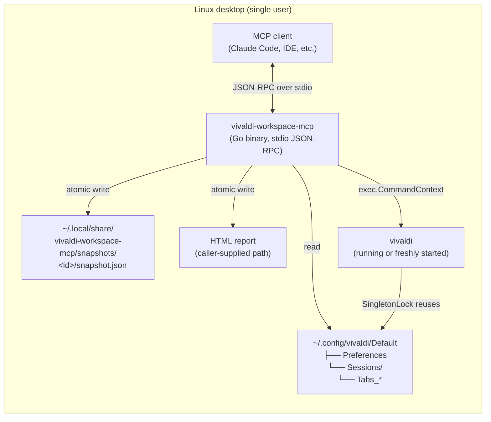

# Architecture

`vivaldi-workspace-mcp` is a **local-only** Model Context Protocol (MCP)
server written in Go. It speaks JSON-RPC over stdio to a single MCP
client (typically an AI assistant such as Claude Code or any MCP-aware
IDE) and exposes 7 tools that read, export, and (lightly) modify a
Vivaldi browser profile on the same machine.

## High-level diagram



The server **never** opens a TCP port, never speaks to a remote service,
and never writes outside the user-supplied HTML export path and
`$XDG_DATA_HOME/vivaldi-workspace-mcp/`. See
[security-model.md](security-model.md) for the full trust boundary.

## Tool surface

All 7 tools are declared with explicit MCP `ToolAnnotations` so the
client can render "this inspects" vs "this may modify state" hints
correctly. See [security-model.md](security-model.md) for the table.

| Tool | Annotation | Profile read | Profile write | Side effect |
|---|---|---|---|---|
| `list_workspaces` | read-only | yes | no | none |
| `list_workspace_tabs` | read-only | yes (binary session files) | no | none |
| `export_workspace_html` | mutating | yes | no | writes HTML file at caller path |
| `launch_tabs` | mutating | no | no | spawns `vivaldi` with URLs |
| `save_workspace_snapshot` | mutating | yes | no | writes snapshot JSON file |
| `restore_workspace_snapshot` | mutating | yes (snapshot file) | no | spawns `vivaldi` with snapshot URLs in batches of 30 |
| `list_snapshots` | read-only | yes (snapshot dir) | no | none |

## Data flow per tool

### `list_workspaces`

```
loadProfile("")
  └── read ~/.config/vivaldi/Default/Preferences
       └── JSON parse → walk root["vivaldi"]["workspaces"]["list"]
            └── return WorkspaceSummary[]
```

The shape read from `Preferences` is documented inline in
`pkg/vivaldi/profile.go`. The exact JSON path may vary slightly across
Vivaldi versions; the parser falls back to an empty workspace list if
any path is missing.

### `list_workspace_tabs`

```
GetAllProfileTabs("")
  └── read ~/.config/vivaldi/Default/Sessions/
       └── for each Tabs_* file (binary):
            ├── regex-match http(s) URL fragments
            ├── filter chrome-extension / vivaldi / favicon
            └── dedupe across files
            └── return TabsSummary{ Sources[], Tabs[] }
```

Vivaldi stores session state in Chromium's SNSS binary format. We do
not parse the binary header — we treat it as a byte stream and run an
`https?://[^\s\x00-\x1f\x7f-\xff"]+` regex across it. This is robust
to header changes across Vivaldi versions because the URL strings are
stored verbatim regardless of header layout.

### `export_workspace_html`

1. Read tabs (same path as `list_workspace_tabs`).
2. Group by `parsed.Host` (with `www.` stripped).
3. Sort groups descending by tab count.
4. Render an interactive HTML page (vanilla JS search filter).
5. **Atomically write** to caller-supplied `output_path` via
   `filex.WriteFileAtomic` (temp + fsync + rename).

If the process is killed mid-write, the previous HTML file remains
intact at the same path. If the file did not exist before, no partial
file is left behind either.

### `launch_tabs`

1. Parse `urls` (comma-separated, whitespace tolerant).
2. Classify each URL via `splitValidURLs` (only `http(s)://`, min length 12).
3. Resolve the `vivaldi` binary via `exec.LookPath` (fail fast if missing).
4. `exec.CommandContext(vivaldi, accepted...)` with the supplied timeout.
5. Wait briefly for the process to either exit (failure) or stay
   running (success — the SingleInstanceLock reuses the running instance).
6. Return `LaunchResult` with `Binary`, `PID`, `RequestedURLs`,
   `LaunchedURLs`, `RejectedURLs`, `DurationMS`.

See `pkg/vivaldi/launcher.go` for the full Vivaldi CLI semantics and
the list of Chromium-style flags that pass through.

### `save_workspace_snapshot`

1. Read profile + tabs.
2. Distribute tabs across workspaces via round-robin
   (`buildWorkspaceTabs` — heuristic, see `pkg/vivaldi/snapshot.go`).
3. Build a `SnapshotRecord{ SnapshotID, SavedAt, Version, ProfilePath,
   Workspaces, Totals }`.
4. Choose the snapshot directory:
   `$VIVALDI_SNAPSHOT_DIR/<snapshot_id>/` if the env var is set
   (test-only override), else
   `$XDG_DATA_HOME/vivaldi-workspace-mcp/snapshots/<snapshot_id>/`
   (default) or
   `~/.local/share/vivaldi-workspace-mcp/snapshots/<snapshot_id>/`.
5. Atomically write `snapshot.json` (temp + fsync + rename).

### `restore_workspace_snapshot`

1. Load the snapshot record by id.
2. Flatten the URLs across all (or one filtered) workspace(s).
3. Split into chunks of 30 URLs (RestoreBatchSize) to avoid a UI freeze
   in Vivaldi when 200+ tabs are queued at once.
4. For each chunk, call `LaunchURLs` (which already handles
   per-chunk validation, retry, and rejected-url reporting).
5. Continue on partial-failure — `Binary` empty on the chunk's
   `LaunchResult` signals a fatal launch error; otherwise keep going.

### `list_snapshots`

1. Read entries in the snapshot base directory.
2. For each subdirectory that contains a `snapshot.json`:
   - Parse the JSON record.
   - Stat the file for `Bytes`.
3. Sort by `SnapshotID` descending. Because `SnapshotID` defaults to
   the UTC timestamp `YYYY-MM-DDTHH-MM-SSZ`, the lexicographic order
   matches newest-first.
4. Apply optional `limit` (0 = all).

## Concurrency model

The server uses the `mark3labs/mcp-go` SDK which dispatches each
JSON-RPC request on its own goroutine under the hood. Tool handlers
must therefore be safe for concurrent invocation. All of ours are:

- Pure readers (`list_*`) take no locks — the underlying `os.ReadFile`
  calls are independent per request.
- The HTML and snapshot writers each write to a distinct path, so two
  concurrent writes cannot collide. The atomic-write pattern
  (`CreateTemp` → `Write` → `Sync` → `Close` → `Rename`) guarantees the
  on-disk file is always either the old contents or the new contents,
  never partial.
- `LaunchURLs` is also safe to invoke concurrently: each call gets its
  own `exec.Cmd` with its own PID, and the running Vivaldi instance
  serializes URL queueing through its own SingleInstanceLock.

See [go-concurrency.md](go-concurrency.md) for the SDK-level quirk we
have to work around in smoke tests (save→list race).
