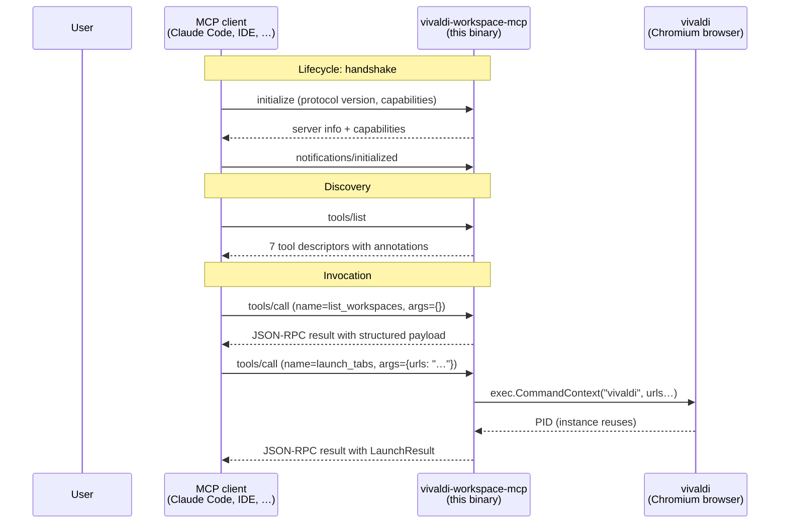

# MCP Protocol Primer

This server speaks the **Model Context Protocol (MCP)**. If you have
never used MCP before, this document is for you.

## What MCP is

MCP is a JSON-RPC 2.0 based protocol that lets a host application
(typically an AI assistant such as Claude Code) call **tools** exposed
by an external **server** process. The host and the server communicate
over a transport — for local servers like this one, the transport is
**stdio**: the server reads JSON-RPC requests from stdin, one per
line, and writes JSON-RPC responses to stdout, one per line.

The protocol was open-sourced by Anthropic in late 2024 and is now
maintained as an open standard with multiple server SDKs across many
languages. The canonical specification lives at
**[github.com/modelcontextprotocol/modelcontextprotocol](https://github.com/modelcontextprotocol/modelcontextprotocol)**.
This server implements the 2024-11-05 protocol revision with the
2025-06-18 `ToolAnnotations` extension.

## How a tool call reaches this server



### Frame format

Every line on the wire is a single JSON object. A request looks like:

```json
{
  "jsonrpc": "2.0",
  "id": 1,
  "method": "initialize",
  "params": { "protocolVersion": "2024-11-05", "capabilities": {} }
}
```

A response looks like:

```json
{
  "jsonrpc": "2.0",
  "id": 1,
  "result": { "serverInfo": { "name": "vivaldi-workspace-mcp", "version": "1.1.0" }, … }
}
```

A notification (fire-and-forget, no `id`, no response) looks like:

```json
{ "jsonrpc": "2.0", "method": "notifications/initialized" }
```

## ToolAnnotations (2025-06-18)

Each tool declares a `ToolAnnotations` block so the client can render
"safety hints" before invoking it. We declare all four fields for every
tool:

| Field | Type | Meaning |
|---|---|---|
| `readOnlyHint` | bool | The tool only inspects state; never modifies it. |
| `destructiveHint` | *bool | The tool can destroy data if it modifies state. We set this to `false` for all our mutating tools because they only append (HTML export, snapshot write) or queue URLs — never delete profile data. |
| `idempotentHint` | bool | Calling the tool twice with the same arguments produces the same observable result. |
| `openWorldHint` | *bool | The tool interacts with the open internet / unknown systems. We set this to `false` everywhere because we only touch the local Vivaldi profile. |

These annotations are *hints only* — clients may use them to drive UI
warnings (e.g. "this tool may modify files on your disk") but the
authoritative behavior is whatever the tool actually does. Treat them
as documentation that travels with the tool descriptor, not as a
security boundary.

## Adding this server to your MCP client

`vivaldi-workspace-mcp` ships as a single Go binary that you run
directly; there is no daemon. The canonical MCP client config for
Claude Code (in `~/.claude/settings.json` under `mcpServers`) is:

```json
{
  "mcpServers": {
    "vivaldi-workspace": {
      "command": "/absolute/path/to/vivaldi-workspace-mcp",
      "args": []
    }
  }
}
```

Any MCP-aware host works — IDE plugins, custom agents, the official
[`mcp-client` CLI](https://github.com/modelcontextprotocol/modelcontextprotocol/tree/main/tools/inspector).

## Tool result envelope

Every successful tool call returns a `CallToolResult` with a `content`
array. We always emit exactly one `text` content item whose payload is
a JSON-encoded struct. For example, `list_workspaces` returns:

```json
{
  "profile_path": "/home/lou/.config/vivaldi/Default",
  "count": 6,
  "workspaces": [
    {"id": "1", "name": "Developer", "icon": "code", "index": 0},
    …
  ]
}
```

Errors use a `ToolError` envelope so the failure mode is also
structured:

```json
{ "code": "profile_load_failed", "message": "…", "hint": "Verify Vivaldi is installed and ~/.config/vivaldi/Default/Preferences exists." }
```

See `pkg/vivaldi/types.go` for the full type definitions.

## Further reading

- MCP specification: <https://github.com/modelcontextprotocol/modelcontextprotocol>
- This server's `mark3labs/mcp-go` SDK: <https://github.com/mark3labs/mcp-go>
- The 2025-06-18 annotations spec is in the same repository under `specification/2025-06-18/`.
